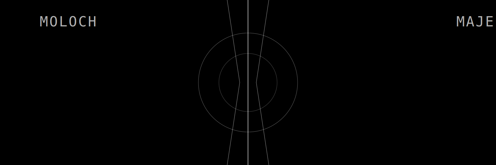
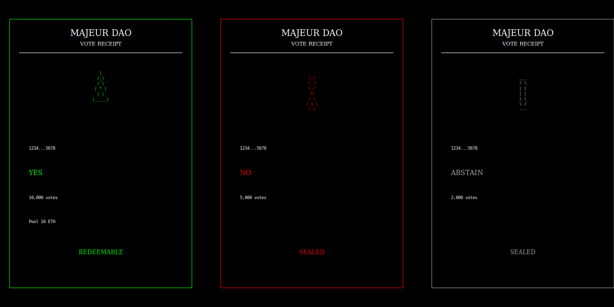

# Moloch (Majeur) DAO Framework

[](https://opensource.org/licenses/MIT)
[](https://docs.soliditylang.org/en/v0.8.30/)
[](https://getfoundry.sh/)



**Opinionated DAO governance** — members can always exit with their share of the treasury. Built-in futarchy, weighted delegation, and soulbound badges.

## Why Majeur?

- Ragequit — exit with your share of the treasury
- Futarchy — prediction markets on proposals
- Split delegation — divide votes across multiple delegates
- On-chain SVG metadata — no IPFS, no servers
- DUNA legal wrapper support

## Deployments

All contracts are deployed at the same CREATE2 addresses across supported networks.

| Contract | Address | Description |
|----------|---------|-------------|
| Summoner | [`0x0000000000330B8df9E3bc5E553074DA58eE9138`](https://contractscan.xyz/contract/0x0000000000330B8df9E3bc5E553074DA58eE9138) | Factory for deploying new DAOs |
| Renderer | [`0x000000000011C799980827F52d3137b4abD6E654`](https://contractscan.xyz/contract/0x000000000011C799980827F52d3137b4abD6E654) | On-chain SVG metadata renderer |
| MolochViewHelper | [`0x00000000006631040967E58e3430e4B77921a2db`](https://contractscan.xyz/contract/0x00000000006631040967E58e3430e4B77921a2db) | Batch read helper for dApps |
| Tribute | [`0x000000000066524fcf78Dc1E41E9D525d9ea73D0`](https://contractscan.xyz/contract/0x000000000066524fcf78Dc1E41E9D525d9ea73D0) | OTC escrow for tribute proposals |
| ShareBurner | [`0x000000000040084694F7B6fb2846D067B4c3Aa9f`](https://contractscan.xyz/contract/0x000000000040084694F7B6fb2846D067B4c3Aa9f) | Burn unsold shares after sale deadline |
| ZAMM | [`0x000000000000040470635EB91b7CE4D132D616eD`](https://contractscan.xyz/contract/0x000000000000040470635EB91b7CE4D132D616eD) | AMM for LP seed swaps |
| SafeSummoner | [`0x00000000004473e1f31c8266612e7fd5504e6f2a`](https://contractscan.xyz/contract/0x00000000004473e1f31c8266612e7fd5504e6f2a) | Safe deployment wrapper with validated config |

### Implementations

Minimal proxy clones are deployed from these implementation contracts. Each DAO gets its own clone of Moloch, Shares, Loot, and Badges via CREATE2.

| Contract | Address | Description |
|----------|---------|-------------|
| Moloch | [`0x643A45B599D81be3f3A68F37EB3De55fF10673C1`](https://contractscan.xyz/contract/0x643A45B599D81be3f3A68F37EB3De55fF10673C1) | DAO governance logic |
| Shares | [`0x71E9b38d301b5A58cb998C1295045FE276Acf600`](https://contractscan.xyz/contract/0x71E9b38d301b5A58cb998C1295045FE276Acf600) | ERC-20 voting token |
| Loot | [`0x6f1f2aF76a3aDD953277e9F369242697C87bc6A5`](https://contractscan.xyz/contract/0x6f1f2aF76a3aDD953277e9F369242697C87bc6A5) | ERC-20 non-voting token |
| Badges | [`0x47C175Ce83B6B931ccBedD5ce95e701984eD96d5`](https://contractscan.xyz/contract/0x47C175Ce83B6B931ccBedD5ce95e701984eD96d5) | ERC-721 soulbound NFT |

## Dapps

> [zfi.wei/dao](https://zfi.wei.is/dao/)

> [majeurdao.eth](https://majeurdao.eth.limo/)

> [daicowtf.eth](https://daicowtf.eth.limo/)

## Token System

| Token | Standard | Purpose |
|-------|----------|---------|
| **Shares** | ERC-20 | Voting power + economic rights (delegatable) |
| **Loot** | ERC-20 | Economic rights only — no voting |
| **Receipts** | ERC-6909 | Vote receipts for futarchy payouts |
| **Badges** | ERC-721 | Soulbound NFTs for top 256 shareholders |

Shares, Loot, and Badges deploy as minimal proxy clones. Receipts live inside the Moloch contract. The DAO controls minting, burning, and transfer locks.

## Architecture


## Core Concepts

### Ragequit
Burn shares/loot → receive your pro-rata cut of the treasury. Own 10%? Claim 10% of every token. Only external tokens (ETH, USDC, etc.) — not the DAO's own shares, loot, or badges.

### Futarchy
Prediction markets on proposals. Anyone funds a reward pool → voters receive receipt tokens → winning side splits the pool.

### Split Delegation
Divide voting power across multiple delegates (e.g. 60% Alice, 40% Bob).

### Badges
Soulbound NFTs for the top 256 shareholders. Auto-update as balances change. Gate on-chain chat.

### Wyoming DUNA
Majeur supports Wyoming's **Decentralized Unincorporated Nonprofit Association (DUNA)** (Wyoming Statute 17-32-101). On-chain covenant in metadata, badge-based member registry, permanent governance records, ragequit as a legal exit right.

## Proposal Lifecycle


```
Unopened → Active → Succeeded → Queued (if timelock) → Executed
                 ↘ Defeated
                 ↘ Expired (TTL)
```

**Pass conditions** (all must hold): quorum reached, FOR > AGAINST, minimum YES threshold met (if set), not expired.

## Quick Start

### Deploy a DAO

```solidity
Summoner summoner = new Summoner();
Moloch dao = summoner.summon(
    "MyDAO",           // name
    "MYDAO",           // symbol
    "",                // URI
    5000,              // 50% quorum (bps)
    true,              // ragequittable
    address(0),        // renderer (0 = default on-chain SVG)
    bytes32(0),        // salt
    [alice, bob, charlie],
    [100e18, 50e18, 50e18],
    new Call[](0)
);
```

### Create & Vote on Proposals

```solidity
uint256 proposalId = dao.proposalId(0, to, value, data, nonce);

dao.castVote(proposalId, 1);  // 0=AGAINST, 1=FOR, 2=ABSTAIN

dao.executeByVotes(0, to, value, data, nonce);
```

### Weighted Delegation (Split Voting Power)

```solidity
dao.shares().setSplitDelegation([alice, bob], [6000, 4000]);  // must sum to 10000
dao.shares().clearSplitDelegation();
```

### Futarchy Markets

```solidity
dao.fundFutarchy(proposalId, address(0), 1 ether);  // 0 = ETH
dao.cashOutFutarchy(proposalId, myReceiptBalance);
```

### Token Sales

```solidity
// DAO configures sale (governance action)
dao.setSale(address(0), 0.01 ether, 1000e18, true, true, false);
//          token       price        cap       mint  active isLoot

// Users buy
dao.buyShares{value: 1 ether}(address(0), 100e18, 1 ether);
//                              token     shares   maxPay
```

### Ragequit

```solidity
dao.ragequit([weth, usdc, dai], myShares, myLoot);  // tokens must be sorted
```

## Advanced Features

### Pre-Authorized Permits

Permits let specific addresses execute actions without voting:

```solidity
dao.setPermit(op, to, value, data, nonce, alice, 1);  // DAO issues
dao.spendPermit(op, to, value, data, nonce);            // Alice spends
```

### Timelocks

```solidity
dao.setTimelockDelay(2 days);
dao.setProposalTTL(7 days);
```

### Member Chat (Badge-Gated)

```solidity
dao.chat("Hello DAO members!");  // top 256 only
```

## Common Pitfalls

### Forgetting to sort tokens in ragequit
```solidity
// Wrong - will revert if not sorted
address[] memory tokens = [dai, weth, usdc];

// Correct - tokens sorted by address
address[] memory tokens = [dai, usdc, weth]; // sorted ascending
```

### Wrong basis points in delegation
```solidity
// Wrong - doesn't sum to 10000
uint32[] memory bps = [6000, 3000]; // 90% total

// Correct - must sum to exactly 10000
uint32[] memory bps = [6000, 4000]; // 100% total
```

## Contract Architecture

```
Summoner (Factory)
└── Deploys via CREATE2 + minimal proxy clones
    │
    ├── Moloch (Main DAO Contract)
    │   ├── Governance logic (proposals, voting, execution)
    │   ├── ERC-6909 receipts (multi-token vote receipts)
    │   ├── Futarchy markets
    │   ├── Ragequit mechanism
    │   └── Token sales
    │
    ├── Shares (Separate ERC-20 + ERC-20Votes Clone)
    │   ├── Voting power tokens
    │   ├── Transferable/Lockable (DAO-controlled)
    │   ├── Single delegation or split delegation
    │   └── Checkpoint-based vote tracking
    │
    ├── Loot (Separate ERC-20 Clone)
    │   ├── Non-voting economic tokens
    │   └── Transferable/Lockable (DAO-controlled)
    │
    └── Badges (Separate ERC-721 Clone)
        ├── Soulbound (non-transferable) NFTs
        ├── Automatically minted for top 256 shareholders
        └── Auto-updated as balances change

Renderer (Singleton)
├── On-chain SVG generation
├── DUNA covenant display
├── DAO contract metadata
├── Proposal cards
├── Vote receipt cards
├── Permit cards
└── Badge cards
```

## Peripheral Contracts

### Tribute (OTC Escrow)

Trade external assets for DAO membership:

```solidity
// 1. Proposer locks tribute (e.g., 10 ETH for 1000 shares)
tribute.proposeTribute{value: 10 ether}(
    dao,           // target DAO
    address(0),    // tribTkn (ETH)
    0,             // tribAmt (use msg.value for ETH)
    sharesToken,   // forTkn (what proposer wants)
    1000e18        // forAmt (how much)
);

// 2. DAO votes to accept, then claims (executes the swap)
// DAO receives tribute, proposer receives shares
dao.executeByVotes(...); // calls tribute.claimTribute(proposer, tribTkn, tribAmt, forTkn, forAmt)
```

**Key functions:**
- `proposeTribute()` - Lock assets and create offer
- `cancelTribute()` - Proposer withdraws (before DAO claims)
- `claimTribute()` - DAO accepts and executes swap
- `getActiveDaoTributes()` - View all pending tributes for a DAO

### MolochViewHelper (Batch Reader)

Batch reads for dApp frontends:

```solidity
// Fetch full state for multiple DAOs in one call
DAOLens[] memory daos = helper.getDAOsFullState(
    0,      // daoStart
    10,     // daoCount
    0,      // proposalStart
    5,      // proposalCount
    0,      // messageStart
    10,     // messageCount
    tokens  // treasury tokens to check
);

// User portfolio: find all DAOs where user is a member
UserMemberView[] memory myDaos = helper.getUserDAOs(
    user, 0, 100, tokens
);
```

Returns `DAOLens` (full state), `MemberView` (balances, delegation), `ProposalView` (tallies, state, futarchy).

### ShareSale (Share/Loot Sales via Allowance)

Sell shares or loot via the allowance system. Uses Moloch's `_payout` sentinels (`address(dao)` mints shares, `address(1007)` mints loot) with 1e18-scaled pricing.

```solidity
// Setup (in SafeSummoner extraCalls or initCalls):
// 1. dao.setAllowance(shareSale, address(dao), cap)  // or address(1007) for loot
// 2. shareSale.configure(address(dao), payToken, price, deadline)

// Users buy shares
shareSale.buy{value: cost}(dao, 10e18);  // 10 shares

// Pricing: cost = amount * price / 1e18
// e.g. price = 0.01e18 means 0.01 ETH per share
```

**Key functions:**
- `configure()` - Set sale token, payment token, price, and deadline (called by DAO)
- `buy()` - Purchase shares/loot (permissionless, refunds overpayment)
- `saleInitCalls()` - Generate initCalls for setup

### TapVest (Linear Vesting via Allowance)

Linear vesting from a DAO treasury via the allowance system.

```solidity
// Setup (in SafeSummoner extraCalls or initCalls):
// 1. dao.setAllowance(tap, token, totalBudget)
// 2. tap.configure(token, beneficiary, ratePerSec)

// Anyone can trigger claim — funds always go to beneficiary
tap.claim(dao);

// View functions
tap.claimable(dao);  // min(owed, allowance, daoBalance)
tap.pending(dao);    // total owed (ignoring caps)
```

**Vesting formula:** `owed = ratePerSec * elapsed`, capped by `min(owed, allowance, daoBalance)`.

**DAO governance:**
- `setBeneficiary()` - Change recipient (DAO-only)
- `setRate()` - Change rate, non-retroactive: unclaimed accrual is forfeited (DAO-only). Set to 0 to freeze.

### LPSeedSwapHook (Automatic LP Initialization)

Seeds ZAMM liquidity from DAO treasury. Gates `addLiquidity` pre-seed, returns swap fees post-seed.

```solidity
// Configured automatically via SafeSummoner SeedModule, or manually:
// 1. dao.setAllowance(lpHook, tokenA, amountA)
// 2. dao.setAllowance(lpHook, tokenB, amountB)
// 3. lpHook.configure(...)

// Anyone can trigger once conditions are met
lpHook.seed(dao);
lpHook.seedable(dao);  // check if ready
```

### ShareBurner (Post-Sale Cleanup)

Burns unsold shares after a sale deadline. DAOs issue a one-shot permit during setup.

```solidity
// Setup via SafeSummoner (automatic when saleBurnDeadline > 0):
// 1. dao.setPermit(op=1, target=burner, ..., spender=burner, count=1)

// After deadline, anyone can trigger the burn
shareBurner.closeSale(dao, sharesAddr, deadline, nonce);
```

### SafeSummoner (Deployment Wrapper)

Wraps the Summoner with audit-derived configuration guardrails. Validates `SafeConfig` structs and builds `initCalls` automatically.

```solidity
// Preset deployments (one-call with sane defaults)
safe.summonStandard(name, symbol, uri, salt, holders, shares, lockShares);  // 7d/2d/10%
safe.summonFast(name, symbol, uri, salt, holders, shares, lockShares);      // 3d/1d/5%
safe.summonFounder(name, symbol, uri, salt);                                // 1d/none/10%/solo

// Full control
safe.safeSummon(name, symbol, uri, quorum, ragequittable, renderer, salt,
    holders, shares, loot, config, extraCalls);

// With modular sale/tap/LP (replaces legacy DAICO)
safe.safeSummonDAICO(name, symbol, uri, quorum, ragequittable, renderer, salt,
    holders, shares, loot, config, sale, tap, seed, extraCalls);
safe.summonStandardDAICO(name, symbol, uri, salt, holders, shares, lockShares, sale, tap, seed);
safe.summonFastDAICO(name, symbol, uri, salt, holders, shares, lockShares, sale, tap, seed);

// Utilities
safe.predictDAO(salt, holders, shares);
safe.predictShares(dao);
safe.predictLoot(dao);
safe.previewCalls(config);
```

Modules: `ShareSale`, `TapVest`, `LPSeedSwapHook` — configured via `SaleModule`, `TapModule`, `SeedModule` structs. Set `singleton = address(0)` to skip.

## Visual Cards





## Integration

```javascript
const shares = await dao.shares();
const totalSupply = await shares.totalSupply();
const myBalance = await shares.balanceOf(account);
const myVotes = await shares.getVotes(account);

// Check proposal state
const state = await dao.state(proposalId);
// States: 0=Unopened, 1=Active, 2=Queued, 3=Succeeded, 4=Defeated, 5=Expired, 6=Executed

// Get vote tally
const tally = await dao.tallies(proposalId);
console.log(`FOR: ${tally.forVotes}, AGAINST: ${tally.againstVotes}`);
```

Key events: `Opened`, `Voted`, `Executed`, `SaleUpdated`.

## Development

### Build & Test

```bash
# Install Foundry
curl -L https://foundry.paradigm.xyz | bash
foundryup

# Build
forge build

# Run all tests
forge test

# Run with verbosity
forge test -vvv

# Run specific test file
forge test --match-path test/Moloch.t.sol

# Run specific test
forge test --match-test test_Ragequit

# Gas snapshot
forge snapshot
```

### Test Suite

| File | Coverage |
|------|----------|
| `Moloch.t.sol` | Core governance: voting, delegation, execution, ragequit, futarchy, badges |
| `Tribute.t.sol` | OTC escrow: propose, cancel, claim tributes |
| `MolochViewHelper.t.sol` | Batch read functions for dApps |
| `SafeSummoner.t.sol` | Preset deployments, config validation, ShareBurner integration, address prediction |
| `ShareSale.t.sol` | Share/loot purchases, refunds, allowance caps, pricing |
| `TapVest.t.sol` | Linear vesting claims, rate changes, beneficiary updates, cap enforcement |
| `LPSeedSwapHook.t.sol` | LP seed swap hook for automatic ZAMM LP initialization |
| `RollbackGuardian.t.sol` | Rollback guardian for emergency DAO recovery |
| `ContractURI.t.sol` | On-chain metadata and DUNA covenant |
| `URIVisualization.t.sol` | SVG rendering for cards |
| `Bytecodesize.t.sol` | Contract size limits |

**Key test scenarios:**
- Proposal lifecycle (open → vote → queue → execute)
- Split delegation with multiple delegates
- Futarchy funding and payout
- Ragequit with multiple tokens
- Badge auto-updates on balance changes
- Tribute propose/cancel/claim flows
- SafeSummoner preset guardrails and ShareBurner permits
- ShareSale buy/refund/cap flows with ETH
- TapVest claim/rate/beneficiary governance
- LP seed swap hook initialization
- Rollback guardian emergency recovery

### Gas Optimization

| Technique | Savings | Details |
|-----------|---------|---------|
| Clone pattern | ~80% deployment | Minimal proxy clones for Shares, Loot, Badges |
| Transient storage | ~5k/call | EIP-1153 for reentrancy guards |
| Badge bitmap | ~20k/update | 256 holders in single storage slot |
| Packed structs | ~20k/write | Tallies use 3 × uint96 for compact storage |

### Deploy

```bash
forge script script/Deploy.s.sol --rpc-url $RPC_URL --broadcast
```

## Security Model

| Protection | Mechanism |
|------------|-----------|
| Flash loan attacks | Snapshot at block N-1 |
| Reentrancy | Transient storage guards (EIP-1153) |
| Majority tyranny | Ragequit — minorities can exit with their share |
| Malicious proposals | Timelocks give time to ragequit; `bumpConfig()` invalidates all pending |
| Token reentrancy | Ragequit requires sorted token arrays |

## Audits

Moloch.sol has been scanned by thirty-one independent audit tools. Reports with per-finding review notes are in [`/audit`](./audit/). Formal verification specs and harnesses are in [`/certora`](./certora/).

| Auditor | Type | Findings | Report |
|---------|------|----------|--------|
| [Zellic V12](./audit/zellic.md) | [Vulnerability scan](https://v12.zellic.io/) | 24 (all false positive, design tradeoff, or low-confidence) | No production blockers |
| [Plainshift AI](./audit/plainshift.md) | [Vulnerability scan](https://hackmd.io/@ileakalpha/SJn2083tWg) | 3 (2 High, 1 Medium — all design tradeoffs) | No production blockers |
| [Octane](./audit/octane.md) | [Vulnerability scan](https://app.octane.security/) | 26 vulns + 23 warnings | 4 valid observations, no production blockers |
| [Pashov Skills](./audit/pashov.md) | [Vulnerability scan (deep)](https://github.com/pashov/skills) | 13 (deduplicated from 5 agents) | 2 novel findings, 1 false positive, no production blockers |
| [Trail of Bits Skills](./audit/trailofbits.md) | [Sharp edges + maturity](https://github.com/trailofbits/skills) | 20 footguns + 9-category scorecard (2.67/4.0) | Validates config guidance, no production blockers |
| [Cyfrin Solskill](./audit/cyfrin.md) | [Development standards](https://github.com/Cyfrin/solskill) | 32 standards evaluated (21 compliant, 5 partial, 3 non-compliant by design, 3 N/A) | Strong adherence, 2 trivial actionable items |
| [SCV Scan](./audit/scvscan.md) | [Vulnerability scan (36 classes)](https://github.com/kadenzipfel/scv-scan) | 3 confirmed (2 Low, 1 Informational) from 36 classes | All duplicates of prior findings, no production blockers |
| [QuillShield](./audit/quillshield.md) | [Multi-layer audit (8 plugins)](https://github.com/quillai-network/qs_skills) | 8 findings (3 Medium, 3 Low, 2 Info) | All duplicates or design tradeoffs, no production blockers |
| [Archethect SC-Auditor](./audit/archethect.md) | [Map-Hunt-Attack + MCP tools (Slither, Aderyn, Solodit, Cyfrin checklist)](https://github.com/Archethect/sc-auditor) | 0 novel (8 spots falsified, 397 Slither + 21 Aderyn findings triaged, 1 KF#8 duplicate via Solodit) | V2 re-run with full MCP integration validates V1 manual results, no production blockers |
| [HackenProof Triage](./audit/hackenproof.md) | [Bug bounty triage (severity re-classification)](https://github.com/hackenproof-public/skills) | 14 triaged: 0 Critical, 0 High, 2 Medium, 5 Low, 5 OOS | No Critical/High under bounty standards |
| [Forefy](./audit/forefy.md) | [Multi-expert audit (10 fv-sol categories + governance context)](https://github.com/forefy/.context) | 8 Low (1 valid, 2 questionable, 5 dismissed) | All duplicates, no novel findings, no production blockers |
| [Claudit (Solodit)](./audit/claudit.md) | [Prior art cross-reference (20k+ real findings)](https://github.com/marchev/claudit) | 12 patterns searched, 0 novel | Validates defenses against Nouns/Olympus/PartyDAO exploits |
| [Auditmos](./audit/auditmos.md) | [Multi-skill checklist (6 of 14 skills applied)](https://github.com/auditmos/skills) | 2 Low, 1 Informational | All duplicates, no production blockers |
| [EVM MCP Tools](./audit/evmtools.md) | [Regex heuristic scan (5 checks)](https://github.com/0xGval/evm-mcp-tools) | 0 confirmed (1 informational) | Tool too basic for governance contracts, no production blockers |
| [Claude (Opus 4.6)](./audit/claude.md) | [3-round AI audit (systematic → economic → triager)](./SECURITY.md) | 1 Medium, 1 Low, 1 Informational | 1 novel observation (post-queue voting — by design), no production blockers |
| [Gemini (Gemini 3)](./audit/gemini.md) | [3-round AI audit (2 passes)](https://gemini.google.com/) | Pass 1: 1 Low (false positive), 1 Info; Pass 2: 5 items (all known/design) | No novel findings across either pass, no production blockers |
| [ChatGPT (GPT 5.4)](./audit/chatgpt.md) | [3-round AI audit (systematic → economic → triager)](https://chat.openai.com/) | 1 Medium (novel), 1 Low (duplicate) | 1 novel finding (public futarchy freeze), no production blockers |
| [DeepSeek (V3.2 Speciale)](./audit/deepseek.md) | [3-round AI audit (systematic → economic → triager)](https://chat.deepseek.com/) | 1 Low (duplicate) | Front-run cancel is KF#11, no production blockers |
| [ZeroSkills Slot Sleuth](./audit/zeroskills.md) | [EVM storage-safety scan (5-phase)](https://github.com/zerocoolailabs/ZeroSkills) | 0 | No storage-safety vulnerabilities; no manual slot arithmetic, no upgradeable proxies, no lost writes |
| [Qwen](./audit/qwen.md) | [3-round AI audit (Qwen3.5-Plus)](https://chat.qwen.ai/) | 1 Medium, 1 Low, 1 Info (all duplicates) | No novel findings, competent methodology compliance |
| [ChatGPT Pro (GPT 5.4 Pro)](./audit/chatgptpro.md) | [3-round AI audit (systematic → economic → triager)](https://chat.openai.com/) | 1 Medium (novel), 1 Low, 1 Info (2 duplicates) | 1 novel finding (dead futarchy pools on executed IDs), no production blockers |
| [Certora FV](./audit/certora.md) | [Formal verification (142 properties, 7 contracts)](./certora/) | 1 Low, 2 Informational (all acknowledged, by design) | 126 invariants verified; L-01 tap forfeiture is intentional Moloch exit-rights design |
| [Grimoire](./audit/grimoire.md) | [Agentic audit (4 sigils + 3 familiars)](https://github.com/JoranHonig/grimoire) | 10 confirmed (1 High, 4 Medium, 5 Low, 2 Info — all duplicates) | 0 novel; adversarial triage dismissed 3 false positives, reentrancy surface fully clean |
| [Cantina Apex](./audit/cantina.md) | [Quick scan (smart contracts + frontend)](https://cantina.xyz/) | 4 High, 20 Medium (5 novel SC findings + ~18 novel frontend findings) | First to cover frontend and peripherals; most novel findings of any single audit; no production blockers. **Frontend findings patched in demo dapp** (XSS class, chain mismatch, ABI fix, token classification, decimal validation, deep-link provenance) |
| [Solarizer](./audit/solarizer.md) | [AI multi-phase security engine (static + semantic + cross-contract)](https://solarizer.io/) | 1 High, 3 Medium, 15 Low, 5 Info, 5 Gas (0 novel) | All duplicates, false positives, or design observations; "D" security grade is misleading (HIGH-1 is intentional post-queue voting); 3 false positives (multicall access control, checkpoint asymmetry, proposerOf hijack); no production blockers |
| [Almanax](./audit/almanax.md) | [Vulnerability scan](https://almanax.ai/) | 1 High, 2 Medium, 2 Low (0 novel) | All duplicates of known findings (KF#3, KF#8, KF#11, KF#18); no production blockers |
| [Archethect SC-Auditor V2](./audit/archethect2.md) | [Map-Hunt-Attack V2 + PoC suite (sc-auditor v0.4.0)](https://github.com/Archethect/sc-auditor) | 16 claimed (4H, 5M, 5L, 2 design) — 2 novel, 13 duplicates, 1 config-mitigated | 2 novel findings (ragequit front-run, sale transfer lock bypass); significant severity inflation (all 4 HIGHs are known/config-dependent); 14 PoC tests provide useful regression coverage; no production blockers |
| [Ackee Wake Arena](./audit/ackee.md) | [Vulnerability scan](https://wake-arena-stage.web.app/) | 6 (1H, 3M, 1L — all duplicates) | 0 novel findings; all 6 are duplicates of known findings (KF#1, KF#3, KF#6, KF#15) or previously identified patterns; no production blockers |
| [Auron](./audit/auron.md) | Vulnerability report | 1 Low (1 novel — downgraded from reported High) | 1 novel finding: self-transfer under split delegation produces non-canceling vote deltas. Invariant violation is real but not practically exploitable with 18-decimal tokens — rounding asymmetry is sub-wei dust. Fix recommended for correctness; no production blockers |
| [webrainsec](./audit/webrainsec.md) | Security audit (multi-contract) | 20 (2H, 7M, 11L — 0 novel, all duplicates) | 0 novel findings; all 20 are duplicates of known findings or target obsolete DAICO.sol (removed). Strong cross-feature interaction analysis (M-05, M-06). 4 findings target obsolete DAICO.sol. Well-constructed PoCs; no production blockers |
| [Winfunc](./audit/winfunc.md) | [Validated vulnerability scan (smart-contract mode)](https://winfunc.com/) | 28 (1C, 10H, 16M, 1L — 0 novel Moloch.sol core, 12 novel peripheral root causes, 8 duplicates/variants) | 0 novel Moloch.sol findings; all core findings are duplicates of KF#1, KF#3, KF#11, KF#17, KF#21. 12 novel root causes target peripheral contracts (LPSeedSwapHook, ShareBurner, TapVest, ShareSale, Tribute, MolochViewHelper) — candidates for per-contract audit extraction. Significant severity inflation on Moloch.sol duplicates (Critical = KF#17/Medium, Highs = KF#3+KF#11/Low). Zero false positives; no production blockers |

**No production blockers were identified across any audit.** Thirteen novel Moloch.sol core findings were surfaced across thirty-one scans (5 from prior audits + 5 from Cantina covering peripheral contracts and namespace issues + 2 from Archethect V2 + 1 from Auron). Winfunc added 0 novel Moloch.sol core findings but identified 12 novel root causes in peripheral contracts (LPSeedSwapHook, ShareBurner, TapVest, ShareSale, Tribute, MolochViewHelper) — candidates for extraction into per-contract audit folders under `src/peripheral/audit/`. Cantina additionally identified ~18 novel frontend findings (XSS and logic bugs) — the first audit to cover the dapp. Configuration-dependent concerns are enforced by [`SafeSummoner`](./src/peripheral/SafeSummoner.sol); code-level issues are candidates for v2 hardening.

**Novel smart contract findings (13):**
1. Vote receipt transferability breaks `cancelVote` (Pashov — Low, design tradeoff)
2. Zero-winner futarchy pool lockup (Pashov — Low, funds remain in DAO treasury)
3. Post-queue voting can flip timelocked proposals (Claude Opus 4.6/SECURITY.md — by design, timelock is a last-objection window)
4. Public `fundFutarchy` + zero-quorum `state()` enables permanent proposal freeze via premature NO-resolution (ChatGPT (GPT 5.4) — Medium, configuration-dependent, enforced by SafeSummoner)
5. `fundFutarchy` accepts executed/cancelled proposal IDs, creating permanently stuck futarchy pools (ChatGPT Pro (GPT 5.4 Pro) — Medium, missing `executed[id]` check)
6. `bumpConfig` emergency brake bypass — lifecycle functions accept raw IDs without config validation (Cantina — Medium, extends KF#10)
7. Tribute bait-and-switch — escrow settlement terms not bound to claim key (Cantina — Medium, Tribute.sol — **patched and redeployed**: v2 `claimTribute()` now requires explicit term verification)
8. Permit IDs enter proposal/futarchy lifecycle — missing `isPermitReceipt` guards enable futarchy pool drain (Cantina — Medium, extends KF#10)
9. DAICO LP drift cap uses wrong variable (`tribForLP` vs `totalTrib`) — shifts tokens from LP to buyer when pool spot > OTC. Buyer pays full price; drift is self-correcting via arb; UIs hide pool until sale completion. Impact is reduced LP depth, not theft (Cantina — Low, DAICO.sol, V2 hardening candidate)
10. Counterfactual Tribute theft via summon frontrun — `initCalls` excluded from salt + Tribute accepts undeployed DAOs (Cantina — Low-Medium, extends KF#9)
11. Ragequit front-run of treasury inflows — `ragequit` reads live `balanceOf(address(this))` with no snapshot, allowing front-running of large inflows for disproportionate extraction (Archethect V2 — Low, attacker must hold shares, marginal profit)
12. Non-minting sale bypasses `transfersLocked` — DAO address exemption in `_checkUnlocked` allows `buyShares` non-minting path to distribute shares despite transfer lock (Archethect V2 — Low, governance configures both sale and lock)
13. Self-transfer under split delegation produces non-canceling vote deltas — `_moveTokens()` applies two deltas on `from == to` that don't cancel under split delegation due to `_targetAlloc` rounding. Invariant violation is real but not practically exploitable with 18-decimal tokens — rounding asymmetry is sub-wei dust (Auron — Low, correctness fix recommended)

**Tool ranking by signal quality:**
- **Cantina Apex** produced the most novel smart contract findings (5) of any single audit, plus ~18 novel frontend findings — the first tool to systematically cover the dapp and peripheral contracts (Tribute, DAICO). The bumpConfig bypass (MAJEUR-15), Tribute bait-and-switch (MAJEUR-10), permit futarchy drain (MAJEUR-21), and DAICO LP math bug (MAJEUR-7) are all code-verified. The frontend XSS findings share a single root cause (`innerHTML` without escaping) but are individually valid. Signal-to-noise: 5 novel SC findings from 24 total (21%).
- **ChatGPT (GPT 5.4)** produced the single highest-impact finding (KF#17, Medium) with the best signal-to-noise ratio (1 novel from 2 total findings, 50%). Its architecture assessment — identifying the boundary between live governance state and prediction-market settlement — is the clearest articulation of the futarchy design tension.
- **ChatGPT Pro (GPT 5.4 Pro)** surfaced the 5th novel finding (KF#18, Medium) — `fundFutarchy` missing `executed[id]` check creates permanently stuck pools on dead proposals. Signal-to-noise: 1 novel from 3 findings (33%). The reentrancy inventory in Category 1 is the most thorough across all 26 audits. LOW-2 (tombstoning) is KF#11 and INFORMATIONAL-3 (auto-futarchy overcommit) was found by 6 prior audits.
- **Pashov Skills** surfaced 2 novel findings via 5 parallel agents with adversarial reasoning. Higher noise (12 findings, 17% novel rate) but broader coverage.
- **Claude (Opus 4.6)** identified a subtle design observation (post-queue voting) that no other tool found, plus the `spendPermit` missing `executed[id]` check (a sharper angle on KF#10, later catalogued as KF#16).
- **Trail of Bits** and **Cyfrin** provided unique non-vulnerability value: maturity scoring (2.67/4.0) and standards compliance (21/32 compliant), respectively.
- **Claudit** validated defenses against real-world exploits (Nouns, Olympus, PartyDAO) — unique cross-reference approach.
- **Octane** produced the most raw findings (49) with 4 valid observations. While none were first-ever novel, Octane provided the most detailed early articulation of the auto-futarchy minted-reward farming vector (vuln #4) — later confirmed by Pashov, Forefy, QuillShield, ChatGPT, ChatGPT Pro, and Qwen. High volume with broad surface coverage — useful for exhaustive first-pass scanning.
- **Gemini (Gemini 3)** and **DeepSeek (V3.2 Speciale)** used the same SECURITY.md prompt as ChatGPT (GPT 5.4) and ChatGPT Pro (GPT 5.4 Pro) but produced zero novel findings, demonstrating that prompt quality alone is insufficient — model capability is the dominant factor.
- **Archethect V1** ran the full Map-Hunt-Attack methodology with MCP tool integration (Slither v0.11.5, Aderyn v0.1.9, Solodit search, Cyfrin checklist). Triaged 397 Slither + 21 Aderyn findings (0 true positives), ran 11 Solodit cross-reference queries, and evaluated 8 suspicious spots. All falsified. The Solodit cross-reference confirmed KF#8 (fee-on-transfer) as the only surviving finding — a duplicate. Zero novel findings, zero false positives escaped the devil's advocate protocol. **Archethect V2** (sc-auditor v0.4.0) is dramatically more productive: 16 findings with 14 PoC tests. However, severity inflation is significant — all 4 HIGHs are known findings or config-dependent issues reclassified upward. 2 genuinely novel findings: ragequit front-run of treasury inflows (MH-015) and non-minting sale bypassing `transfersLocked` (MH-026), both Low. The 14-test PoC suite is the most comprehensive regression coverage from any single audit. Signal-to-noise: 2 novel from 16 total (13%).
- **ZeroSkills Slot Sleuth** ran a 5-phase EVM storage-safety analysis (lost writes, attacker-influenced slots, upgrade collisions, storage semantics). Clean pass — Moloch.sol avoids the vulnerability patterns this detector targets (no assembly `SSTORE`, no manual slot arithmetic, no upgradeable proxies). Useful for confirming architectural hygiene.
- **Forefy**, **QuillShield**, **SCV Scan**, and **Auditmos** each independently confirmed subsets of the known findings, adding cross-validation confidence without novel discoveries. **EVM MCP Tools** was too basic for governance contracts (regex heuristics only).
- **Solarizer** produced the highest volume of findings (29) but zero novel discoveries. Notable for 3 clear false positives: LOW-4 (claims `multicall` bypasses `onlyDAO` — incorrect, `delegatecall` to `address(this)` preserves caller's `msg.sender`), LOW-9 (claims burn/mint checkpoint asymmetry — code is actually symmetric), and MED-1 (claims `proposerOf` hijack enables cancel DOS — blocked by auto-futarchy and re-submittable with different nonce). The "D" security grade and "HIGH" risk rating are driven by HIGH-1, which is the documented intentional post-queue voting design (KF#15). Signal-to-noise: 0 novel from 29 total (0%).
- **Almanax** produced 5 findings (1 High, 2 Medium, 2 Low) — all duplicates of known findings (KF#3, KF#8, KF#11, KF#18). Clean report with no false positives, but zero novel discoveries. The HIGH-1 (auto-futarchy farming) has been found by 9+ prior audits. Signal-to-noise: 0 novel from 5 total (0%).

- **Qwen (Qwen3.5-Plus)** used the same SECURITY.md prompt as ChatGPT, Gemini 3, and DeepSeek V3.2 Speciale. All 3 findings are duplicates (KF#5, auto-futarchy overcommit, KF#1), with an inflated self-assessment claiming 2 novel. Competent category sweep and methodology compliance, but zero novel findings — similar depth to DeepSeek V3.2 Speciale and Gemini 3.

- **Grimoire** uses a two-pass agentic workflow — 4 parallel Sigil agents (hypothesis-driven hunters) followed by 3 parallel Familiar agents (adversarial verifiers that try to disprove each finding). Similar to Pashov Skills' multi-agent approach but with an explicit adversarial triage pass. Covered 10 of 18 known findings (56%) with zero false positives after triage. The reentrancy surface was thoroughly cleared. The Familiar pass correctly dismissed 3 false positives and adjusted severity on 2 findings. No novel findings, but the highest false-positive rejection rate of any tool.

- **Ackee Wake Arena** submitted 6 findings (1 High, 3 Medium, 1 Low) — all duplicates of known findings (KF#1, KF#3, KF#6, KF#15) or previously identified patterns. Finding #1 matches an explicit False Positive Pattern (ragequit drains futarchy pools). The composite High finding (#5) chains known components without novel discovery. Clean code snippets and exploit scenarios, but zero novel findings. Signal-to-noise: 0 novel from 6 total (0%).

- **webrainsec** scanned Moloch.sol plus DAICO.sol, Tribute.sol, SafeSummoner.sol, MolochViewHelper.sol, and Renderer.sol. 20 findings (2H, 7M, 11L), all duplicates — 0 novel. The strongest aspect is cross-feature compositional reasoning: M-05 (auto-futarchy blocks cancel) and M-06 (permit + auto-futarchy + timelock compound) demonstrate good interaction analysis even though both map to known root causes. 4 findings target the obsolete DAICO.sol (removed, replaced by modular peripherals). H-01 (tap forfeiture) honestly acknowledges the Certora prior art. H-02 (buy-ragequit extraction) is KF#2. M-01 (`executeByVotes` return value) is a reasonable API semantics observation. Well-constructed PoCs with concrete output throughout. Signal-to-noise: 0 novel from 20 total (0%).

- **Winfunc** is the first audit to scan the full repository — Moloch.sol core plus all peripheral contracts — producing the highest finding count (28) and the most novel peripheral root causes (12) of any single audit. For Moloch.sol core, all findings are duplicates of KF#1, KF#3, KF#11, KF#17, and KF#21, which further validates the core attack surface coverage. Core duplicate severities are rated higher than the existing corpus (KF#17 at Critical vs Medium, KF#3+KF#11 at High vs Low/Design). The standout value is in peripheral coverage: LPSeedSwapHook pool collision/pre-creation (#3/#5/#9 — first to identify the shared pool namespace gap), ShareBurner over-scope burn (#2), TapVest fake-DAO drain (#15) and partial-claim griefing (#4/#13, extends Certora L-01), ShareSale pricing overflow (#20) and stray ETH (#27), Tribute fake-funding (#14) and discovery spam (#21/#23), MolochViewHelper omissions (#22/#26/#28). Zero false positives across all 28 findings. Signal-to-noise for peripheral contracts: 12 novel root causes from 28 total (43%).

- **Certora FV** is the only formal verification engagement. 142 properties across 7 contracts provide mathematical proofs for critical invariants (sum-of-balances, state machine monotonicity, write-once fields, access control, split delegation constraints, ragequit payout bounds). The L-01 tap forfeiture finding is confirmed via intentional violation (D-L1a) and reachability witness (D-L1b) — a novel angle on ragequit interaction with DAICO, but acknowledged as intentional Moloch exit-rights design. The two informational findings (unbounded Tribute arrays, `mulDiv` phantom overflow) are both known tradeoffs.

- **Auron** identified a novel invariant violation in split-delegation vote accounting: self-transfers produce non-canceling deltas. However, the PoC used 0-decimal balances (raw integer mints like `mintFromMoloch(attacker, 1)` = 1 wei, not 1 share). Exhaustive testing across 11 configurations with realistic 18-decimal balances showed: (a) any transfer ≥ 1e14 wei produces exactly 0 steal, (b) 1-wei transfers consistently benefit the *victim* not the attacker (the "remainder to last" mechanism in `_targetAlloc` penalizes the attacker position), (c) the 4-way split loop (original PoC config) produced exactly 0 net change over 1000 iterations with 18-decimal balances, (d) even the "best" 2-way loop accumulated only 1000 wei (10^-15 of 1 share) over 1000 iterations. Downgraded from reported High to Low. Signal-to-noise: 1 novel from 1 total (100%), but significant severity inflation from unrealistic PoC parameters. Illustrative case study in why PoCs must use deployment-realistic token scales.

Cross-referencing across all thirty-one scans — thirteen independent novel Moloch.sol core findings (plus ~18 novel frontend findings from Cantina and 12 novel peripheral root causes from Winfunc), twenty-four catalogued known findings (KF#1–24), consistent duplicate confirmation across tools, and 142 formally verified invariants — increases confidence that the known findings represent the full Moloch.sol core attack surface. Cantina's coverage of the frontend and peripheral contracts (Tribute, DAICO) opened a new surface area not previously audited. Archethect V2's ragequit front-run and transfer lock bypass findings extend coverage to economic timing attacks and access control edge cases not previously explored. Winfunc's peripheral coverage (LPSeedSwapHook, ShareBurner, TapVest, ShareSale, Tribute, MolochViewHelper) identified 12 novel root causes in contracts not systematically audited before — these findings are candidates for extraction into per-contract security documents under `src/peripheral/audit/`.

### SafeSummoner

[`SafeSummoner.sol`](./src/peripheral/SafeSummoner.sol) is a wrapper around the deployed [Summoner](https://contractscan.xyz/contract/0x0000000000330B8df9E3bc5E553074DA58eE9138) that enforces audit-derived configuration guardrails at deployment time. Instead of hand-encoding raw `initCalls` calldata, deployers fill in a typed `SafeConfig` struct and the contract validates + builds the calls automatically.

| Guard | Finding | What it prevents |
|-------|---------|------------------|
| `proposalThreshold > 0` required | KF#11 | Front-run cancel, proposal spam, minted futarchy farming |
| `proposalTTL > 0` required | Config | Proposals lingering indefinitely |
| `proposalTTL > timelockDelay` | Config | Proposals expiring while queued |
| `quorumBps ≤ 10000` | KF#12 | `init()` skips this range check |
| Non-zero quorum if futarchy enabled | KF#17 | Premature NO-resolution proposal freeze |
| `autoFutarchyCap > 0` if futarchy enabled | KF#3 | Unbounded per-proposal earmarks; default minted-loot reward path has no natural balance cap, enabling NO-coalition treasury farming |
| Block minting sale + dynamic-only quorum | KF#2 | Supply manipulation via buy → ragequit |

DAOs deployed through `SafeSummoner.safeSummon()` cannot hit the configuration footguns identified across the thirty-one audits. The `previewCalls()` function lets frontends inspect exactly which `initCalls` will execute, and `predictDAO()` returns the deterministic address before deployment. An `extraCalls` escape hatch preserves full flexibility for advanced setups (custom allowances, etc.).

### Configuration Guidance for Deployers

Several audit findings highlight configuration combinations that require care. DAOs deploying through [`SafeSummoner`](./src/peripheral/SafeSummoner.sol) get these enforced automatically. For direct Summoner users:

- **Set `proposalThreshold > 0`** — A non-zero threshold gates proposal creation behind real stake, preventing permissionless griefing (front-run cancel, mass proposal opening for minted futarchy rewards).
- **Be thoughtful with minted futarchy rewards** — When `autoFutarchyParam` is set with minted reward tokens (`rewardToken = 0` → minted Loot), the per-proposal `autoFutarchyCap` limits individual proposals but not aggregate exposure across many proposals. Prefer non-minted reward tokens (ETH, or shares/loot held by the DAO) which have natural balance caps.
- **Set a non-zero quorum if futarchy is enabled** — When both `quorumAbsolute` and `quorumBps` are zero, `state()` returns `Defeated` immediately with zero votes. Since `fundFutarchy` is public, an attacker can attach a 1-wei futarchy pool and call `resolveFutarchyNo` to permanently freeze any proposal before voting begins. Any non-zero quorum prevents this because `state()` returns `Active` until quorum is met.
- **Avoid futarchy in concentrated DAOs** — Futarchy is designed to energize broad participation. In DAOs where a small coalition can reach quorum quickly, early NO voters can resolve futarchy and freeze voting before a FOR comeback. Futarchy adds little value in these cases and should not be enabled. Additionally, a majority NO coalition can repeatedly defeat proposals and collect auto-funded futarchy pools — this is by design (NO voters are rewarded for correct governance predictions), but in concentrated DAOs it becomes extractive. The `autoFutarchyCap` bounds per-proposal exposure, and `proposalThreshold > 0` limits who can trigger the earmark cycle.
- **Ragequit is the nuclear exit** — Ragequit gives pro-rata of all DAO-held assets by design, including ETH earmarked for futarchy pools. Futarchy pools are incentive mechanisms subordinate to governance, not restrictive escrows. This is intentional — if excluded from ragequit, a hostile majority could shield treasury via futarchy funding.
- **Sale cap is a soft guardrail** — The `cap` in `setSale` correctly blocks buys exceeding the remaining cap and decrements on each purchase, but uses `0` as the sentinel for both "unlimited" and "exhausted." After exact sell-out (`shareAmount == cap`), the cap resets to 0 and the sale becomes unlimited. This only matters for minting sales where the cap is the sole supply constraint — for non-minting sales, the DAO's held share balance is the real hard cap regardless. Buyers always pay `pricePerShare` so there are no free tokens. The DAO can deactivate the sale at any time via `setSale(..., active: false)`, and `SaleUpdated` events enable off-chain monitoring. V2 hardening candidate: use `type(uint256).max` as the "unlimited" sentinel instead of `0`.
- **Dynamic quorum + minting sale + ragequit** — When all three are enabled, an attacker can inflate supply via `buyShares`, then ragequit after the snapshot, manipulating the quorum denominator. This is economically constrained but worth noting. Consider using absolute quorum (`quorumAbsolute`) instead of percentage-based (`quorumBps`) if minting sales are active.
- **Post-queue voting is intentional** — When `timelockDelay > 0`, voting remains open during the timelock period. This is by design: the timelock serves as a last-objection window where holders who didn't vote during the Active period can register late opposition. A late AGAINST vote with sufficient weight can flip a Succeeded proposal to Defeated after the delay elapses. This is asymmetric — `cancelVote` requires Active state, so existing voters cannot undo votes post-queue. DAOs that prefer Compound-style frozen timelocks should note this behavior.

### v2 Hardening Candidates

Identified through audit review for future contract versions:

- Short-circuit self-transfers in `_moveTokens()` — add `if (from == to) { emit Transfer(from, to, amount); return; }` to prevent split-delegation vote delta invariant violation (Auron L-01, correctness fix)
- Add `executed[id]` check to `fundFutarchy` — prevents dead futarchy pools on cancelled/executed proposals (KF#18)
- Global aggregate cap on auto-futarchy earmarks (or restrict minted rewards to require `proposalThreshold > 0`)
- Decouple futarchy resolution from voting freeze, or require `Expired` only (not `Defeated`) in `resolveFutarchyNo` — prevents premature NO-resolution on live proposals with zero quorum
- Snapshot total supply at proposal creation for quorum calculation (or add cooldown between share purchase and ragequit)
- Bind CREATE2 salt to `msg.sender` in Summoner
- Snapshot loot supply for futarchy earmark basis
- Namespace separation for permit and proposal IDs
- Optional `freezeOnQueue` flag to disable post-queue voting for DAOs that prefer Compound-style frozen timelocks
- Store originating `config` on proposal open; reject lifecycle actions on stale-config proposals (Cantina MAJEUR-15)
- Add `if (isPermitReceipt[id]) revert` guards to `openProposal`, `castVote`, `fundFutarchy`, `resolveFutarchyNo` (Cantina MAJEUR-21)
- Bind `claimTribute` to expected settlement terms via nonce/hash (Cantina MAJEUR-10)
- Include `initCalls` in Summoner `summon` salt (Cantina MAJEUR-17)
- ~~Systematic `innerHTML` → `textContent`/DOM API pass in dapp for all untrusted data sinks (Cantina XSS class)~~ **Patched** in demo dapp
- ~~Hard-block transactional flows on signer chain ≠ app network (Cantina MAJEUR-24, MAJEUR-16)~~ **Patched** in demo dapp
- ~~Fix `fetchAndOpenDAO` ABI to `shares()`/`loot()` (Cantina MAJEUR-12)~~ **Patched** in demo dapp
- ~~Three-way token classification: shares / loot / unverified ERC20 (Cantina MAJEUR-11)~~ **Patched** in demo dapp
- ~~Resolve token decimals from contract, not chat tags (Cantina MAJEUR-14, MAJEUR-9)~~ **Patched** in demo dapp
- ~~Validate 18-decimal requirement for custom token wrapping at submit time (Cantina MAJEUR-20)~~ **Patched** in demo dapp
- ~~Require Summoner provenance for deep-link DAOs (Cantina MAJEUR-8)~~ **Patched** in demo dapp (warning label + code check)
- ~~Route dapp summon through `SafeSummoner.safeSummon()` (Cantina MAJEUR-18)~~ **SafeSummoner deployed**
- Namespace LPSeedSwapHook pool keys by DAO address — use `id0 = uint256(uint160(dao))` to prevent cross-DAO pool collision and ownership takeover (Winfunc #3)
- Reserve LPSeedSwapHook pool ID at `configure()` time, not `seed()` time — prevent pre-creation front-running of launch pricing (Winfunc #5/#9)
- Scope `ShareBurner.burnUnsold()` to tracked sale-inventory amount rather than live `balanceOf(dao)` — prevent burn of unrelated treasury-held shares (Winfunc #2)
- Add `unpaidAccrual` carry field to TapVest — preserve accrued backlog on partial claims during treasury shortfalls (Winfunc #4/#13, extends Certora L-01)
- Validate ShareSale pricing parameters for overflow at configuration time (Winfunc #20)
- Reject `msg.value > 0` in ERC-20-denominated ShareSale purchases (Winfunc #27)
- Wrap `contractURI` calls in try/catch in MolochViewHelper batch functions (Winfunc #22)
- Validate Tribute ERC-20 receipt via balance-before/after check in `proposeTribute` (Winfunc #14)
- Validate TapVest `configure()` caller is a legitimate DAO (Winfunc #15)

## FAQ

### Q: Can I change my vote?
**A:** Yes — `cancelVote(proposalId)` while the proposal is Active. Once it transitions past Active, votes are locked.

### Q: Can I partially ragequit?
**A:** Yes. Specify how many shares/loot to burn.

### Q: How are proposal IDs generated?
**A:** `keccak256(abi.encode(dao, op, to, value, keccak256(data), nonce, config))`. Deterministic — anyone can compute it.

### Q: What's `config`?
**A:** A version number in every proposal ID. `bumpConfig()` invalidates all pending proposals and permits — an emergency brake.

### Q: Built-in sales vs modular sale/tap/LP?
**A:** `setSale()` is simpler — direct minting at a fixed price. The modular approach composes `ShareSale` + `TapVest` + `LPSeedSwapHook` for controlled fund release, vesting, and automatic LP seeding — configured via `SafeSummoner`.

### Q: How does TapVest protect investors?
**A:** It limits how fast ops can withdraw raised funds. The DAO can vote to lower the rate or freeze it. Ragequit auto-adjusts the tap to the reduced treasury.

## Disclaimer

*Reviewed by thirty-one auditing tools (see [Audits](#audits)) — no formal manual audit. Use at your own risk.*

## License

MIT